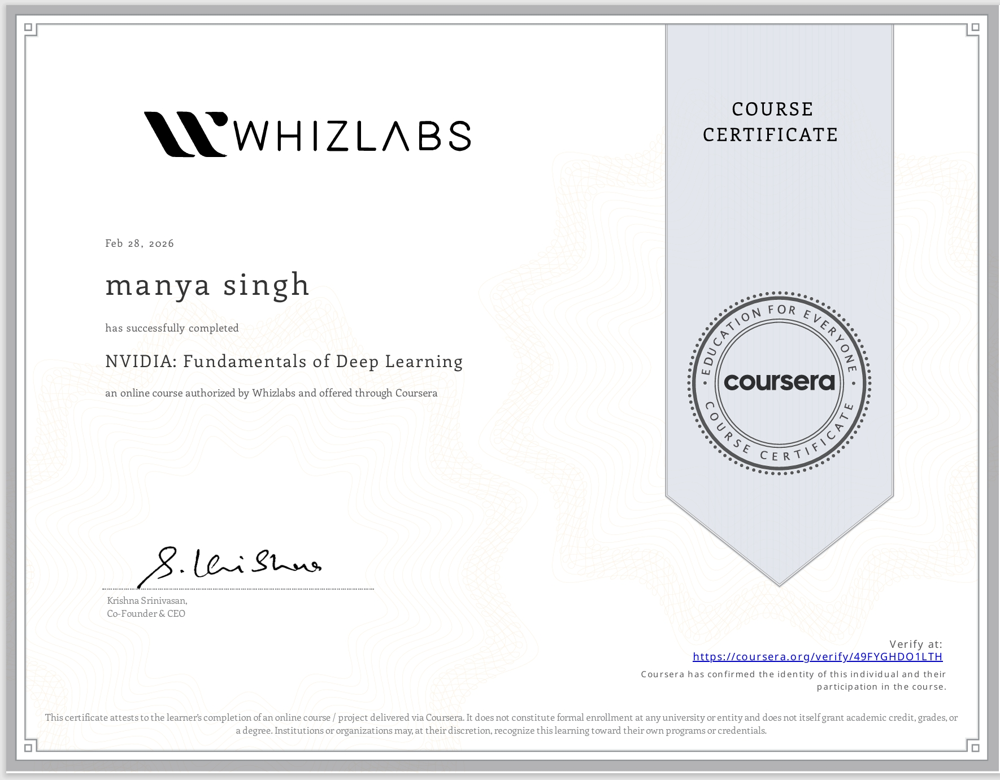

# NVIDIA: Fundamentals of Deep Learning
**Platform:** Coursera || **Offered by:** NVIDIA

## What I Learned

### Module 1 - Foundations of Deep Learning

- How a neuron processes data
- Gradient Descent and how models learn from mistakes
- Forward & Backward Propagation
- Trained a Perceptron from scratch 
- Activation Functions and when to use them

### Module 2 - Advanced Deep Learning Techniques

- Multi-class classification using MNIST dataset
- Training and evaluating a deep learning model
- How Convolutional Neural Networks (CNNs) work
- Transfer Learning and why it is useful
- Applied Transfer Learning on a real image dataset
  
---

## Key Takeaways

- Understood how neural networks learn from data
- Got comfortable with core concepts like backpropagation and activation functions
- Built and evaluated image classifiers
- Learned how CNNs work and why they are powerful for vision tasks
- Applied Transfer Learning on a real image dataset

---

## Certificate

---

